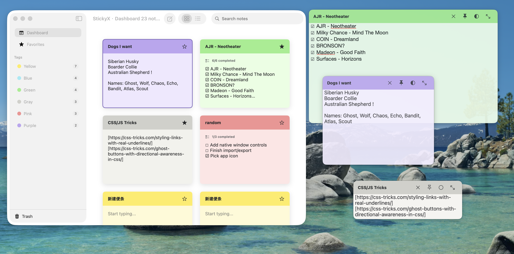

# StickyX

StickyX is a native macOS 14+ sticky notes app built with SwiftUI, AppKit interop, GRDB, and SQLite. The Chinese app name is `轻便笺`.



## Features

- Dashboard with grid and list views.
- Finder-style color tags with custom names and note counts.
- Search, favorites, Trash, restore, permanent delete, and empty Trash.
- Rich text note editing with RTF persistence.
- Inline checklist items using `☐` and `☑`, with completion summaries.
- Desktop sticky windows with saved position and size.
- Desktop controls for close, float on top, translucency, and collapse/expand.
- Appearance settings: Automatic, Light, Dark.
- Language settings: Follow System, Chinese, English.
- Import/export, print, keyboard commands, and macOS Services text-to-note support.

## Requirements

- macOS 14.0 or later.
- Xcode 15 or later, or Swift 5.9 compatible toolchain.
- Network access for first-time Swift Package dependency resolution.

## Tech Stack

- Swift Package Manager
- SwiftUI
- AppKit interop for borderless desktop sticky windows
- GRDB + SQLite
- XCTest

## Project Structure

```text
Sources/
  StickyX/          macOS app, SwiftUI views, commands, window management
  StickerXCore/    data models, SQLite store, checklist parser, layout constants
Tests/
  StickyXTests/
  StickerXCoreTests/
Resources/         app icon resources
Screen/            README showcase images
script/            build and run helpers
```

## Build And Run

Build the Swift package:

```bash
swift build
```

Run the app bundle created by the helper script:

```bash
./script/build_and_run.sh
```

Build, launch, and verify that the app process starts:

```bash
./script/build_and_run.sh --verify
```

Run tests:

```bash
swift test
```

## Data Storage

StickyX stores user data in Application Support:

```text
~/Library/Application Support/StickyX/StickyX.sqlite
```

The database contains notes, checklist items, color tag names, and full-text search data.

## Keyboard Shortcuts

- `Command+N`: New note
- `Command+Shift+L`: Insert checklist item
- `Command+Shift+D`: Show or hide selected desktop note
- `Command+Shift+F`: Toggle float on top
- `Command+Shift+T`: Toggle translucency
- `Command+Shift+M`: Collapse or expand desktop note
- `Command+P`: Print selected note

## Public Repository Notes

The repository keeps source code, tests, scripts, README showcase images, and app icon resources. Local docs, Codex config, generated image outputs, SwiftPM build artifacts, app bundles, SQLite databases, and environment files are ignored by `.gitignore`.

The project is released under the Apache License, Version 2.0. See `LICENSE`, `NOTICE`, and `TRADEMARKS.md` for source license, attribution notices, and trademark guidelines.

Before publishing a GitHub release, decide the signing/notarization workflow.

---

# StickyX 中文说明

StickyX（轻便笺）是一款 macOS 14+ 原生便笺应用，目标是提供接近系统“便笺 / Stickies”的轻量记录体验，同时增加标签、搜索、清单、桌面置顶和多语言设置等常用能力。

应用使用 SwiftUI 构建主界面，通过 AppKit 管理独立桌面便笺窗口，数据使用 GRDB + SQLite 本地存储。便笺内容保存在本机 Application Support 目录中，不依赖云端服务。


## 主要功能

- 主界面支持网格视图和列表视图。
- 颜色标签按 Finder 标签逻辑展示，支持重命名和数量统计。
- 支持搜索、收藏、废纸篓、恢复、永久删除和清空废纸篓。
- 支持富文本编辑，正文以 RTF 持久化。
- 支持正文内清单项，使用 `☐` / `☑` 表示未完成和已完成，并在卡片中展示完成度。
- 支持将便笺独立显示到桌面，保存窗口位置和尺寸。
- 桌面便笺支持关闭、浮动在最前、半透明、折叠和展开。
- 设置支持自动、浅色、深色外观。
- 设置支持跟随系统、中文、English 语言切换。
- 支持导入、导出、打印、快捷键和 macOS Services 从选中文本创建便笺。

## 环境要求

- macOS 14.0 或更高版本。
- Xcode 15 或更高版本，或兼容 Swift 5.9 的工具链。
- 首次解析 Swift Package 依赖时需要网络连接。

## 技术栈

- Swift Package Manager
- SwiftUI
- AppKit 桌面浮窗桥接
- GRDB + SQLite
- XCTest

## 项目结构

```text
Sources/
  StickyX/          macOS App、SwiftUI 视图、菜单命令、窗口管理
  StickerXCore/    数据模型、SQLite 存储、清单解析、窗口布局常量
Tests/
  StickyXTests/
  StickerXCoreTests/
Resources/         App 图标资源
Screen/            README 展示图
script/            构建和运行脚本
```

## 构建与运行

构建 Swift Package：

```bash
swift build
```

使用脚本构建并运行 `.app`：

```bash
./script/build_and_run.sh
```

构建、启动并验证进程是否运行：

```bash
./script/build_and_run.sh --verify
```

运行测试：

```bash
swift test
```

## 数据存储

StickyX 将用户数据存储在本机 Application Support 目录：

```text
~/Library/Application Support/StickyX/StickyX.sqlite
```

数据库包含便笺、清单项、颜色标签名称和全文搜索数据。

## 快捷键

- `Command+N`：新建便笺
- `Command+Shift+L`：插入清单项
- `Command+Shift+D`：显示或隐藏选中便笺的桌面窗口
- `Command+Shift+F`：切换浮动在最前
- `Command+Shift+T`：切换半透明
- `Command+Shift+M`：折叠或展开桌面便笺
- `Command+P`：打印选中便笺

## 公开仓库说明

仓库保留源码、测试、脚本、README 展示图和 App 图标资源。本地文档、Codex 配置、生成图片、SwiftPM 构建产物、`.app` 包、SQLite 数据库和环境文件已通过 `.gitignore` 忽略。

项目使用 Apache License, Version 2.0 开源。源码许可、署名声明和商标使用规则分别见 `LICENSE`、`NOTICE` 和 `TRADEMARKS.md`。

发布 GitHub Release 前，建议确认签名、公证和发布流程。
